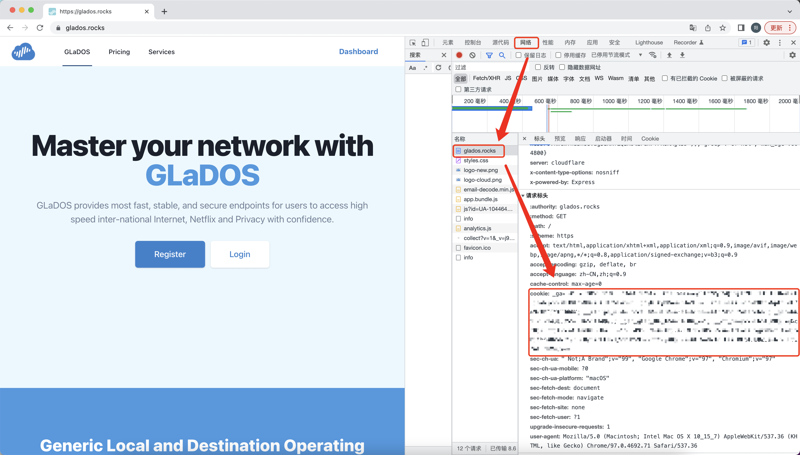

# 源码提供者

[yaoysyao](https://github.com/yaoysyao)

# Auto_CheckIn

- 各大网站自动签到脚本，基于github actions
- 支持多用户签到，多个Cookie之间采用`&@@&`手动分割
- 本项目包含Github Actions keep alive模块，可自动激活Github Actions
- 支持推送消息到pushplus平台(server酱和pushplus选择一个就好，也可以同时推送，如果不配置则不进行推送)
- 支持推送消息到server酱(server酱和pushplus选择一个就好，也可以同时推送，如果不配置则不进行推送)
- 支持自动同步仓库上游代码,参考(自动同步仓库上游代码)部分进行配置

## 建议配置自动同步上游代码，这样可以每周获取最新代码

## 目前支持签到平台

- [GLaDOS平台](https://glados.rocks/)
- [天翼云盘](https://cloud.189.cn/web/login.html)
- [bilibili直播](https://live.bilibili.com)
- [科研通签到](https://www.ablesci.com/)
- [谷粉学术签到](http://bbs.99lb.net/)

## 重要！重要！

### 在fork本项目并配置完成后，请启动工作流并检查是否已经执行签到

### cron定时器设置规则

             ┌──分钟（0 - 59）
             │ ┌──小时（0 - 23）
             │ │ ┌──日（1 - 31）
             │ │ │ ┌─月（1 - 12）
             │ │ │ │ ┌─星期（0 - 6，表示从周日到周六）
    - cron: '1 1 1 1 1'

## 本项目设置的自动签到时间为每天的早上8点5分，时间可能有延迟，这不是错误，如果设置了自动同步代码，则自己修改的自动签到时间会由于同步代码被覆盖，如果想要自己设置时间，就不要设置自动同步代码！！！

## 自动同步代码设置的为每周一20:00同步一次

### 如果要自己定义签到时间和自动同步代码时间，可以在 .github/workflows/auto_checkin.yml 和 .github/workflows/repo-sync.yml 中的 schedule -cron参数，UTC与北京时间对照表如下，设置规则如上所示

### UTC时间与北京时间对照表如下,表格来源于 https://datetime360.com/cn/utc-beijing-time/

  

## 工作流使用教程

### 启动工作流

  

### 执行完毕或者执行失败时，点击进入

  

  

### 如果查看checkin的时候出现error，请多尝试几次,这不是本程序代码错误，是因为actions的问题，如果日志中出现错误，请提出

  

  

## 使用教程

### 各平台签到教程

#### 1. glados签到教程

##### 1.1 添加 GLADOS_COOKIE 至 Secrets

- 登陆[GLaDOS](https://glados.rocks/)后，F12打开开发者工具。
- 刷新网页，并在浏览器中提取复制`Cookie`值，注意不要把`Cookie:`前缀加入进来！！！！！
-

  

- 在项目页面，依次点击`Settings`-->`Secrets`-->`Actions`-->`New repository secret`

  

- 建立名为`GLADOS_COOKIE`的 secret，值为复制的`Cookie`内容，最后点击`Add secret`
- secret名字必须为`GLADOS_COOKIE`，大小写敏感
- 支持多用户签到，多个Cookie之间采用`&@@&`手动分割完成后填入`GLADOS_COOKIE`即可
- 为保护隐私，不在日志中输出任何Id信息，请自行分辨账号顺序

  

#### 2 天翼云盘签到教程

##### 2.1 添加 天翼云盘cookie 至 Secrets

- 同方法1.1,首先需要登录天翼云盘获取cookie，然后建立名为`CLOUD189_COOKIE`的 secret，值为复制的`Cookie`
  内容，最后点击`Add secret`
- 支持多用户签到，多个Cookie之间采用`&@@&`手动分割完成后填入`CLOUD189_COOKIE`即可

#### 3 bilibili直播签到教程

##### 3.1 添加 bilibili直播cookie 至 Secrets

- 同方法1.1,首先需要登录天翼云盘获取cookie，然后建立名为`BILIBILI_COOKIE`的 secret，值为复制的`Cookie`
  内容，最后点击`Add secret`
- 支持多用户签到，多个Cookie之间采用`&@@&`手动分割完成后填入`BILIBILI_COOKIE`即可

#### 4 科研通签到教程

##### 4.1 添加 科研通cookie 至 Secrets

- 同方法1.1,首先需要登录科研通获取cookie，然后建立名为`ABLESCI_COOKIE`的 secret，值为复制的`Cookie`
  内容，最后点击`Add secret`
- 支持多用户签到，多个Cookie之间采用`&@@&`手动分割完成后填入`ABLESCI_COOKIE`即可

#### 5 谷粉学术签到教程

##### 5.1 添加 cookie 至 Secrets

- 同方法1.1,首先需要登录谷粉学术获取cookie，然后建立名为`GUFENXUESHU_COOKIE`的 secret，值为复制的`Cookie`
  内容，最后点击`Add secret`
- 支持多用户签到，多个Cookie之间采用`&@@&`手动分割完成后填入`GUFENXUESHU_COOKIE`即可

### 消息推送配置教程(可选,不配置则不进行推送)

#### 添加 PUSHPLUS的token值 至 Secrets

- 建立名为`PUSHPLUS_TOKEN`的 secret，值为复制的`pushplus（推送加平台的token）`，最后点击`Add secret`
- 登陆[pushplus](http://www.pushplus.plus/)

  

#### 如果使用[server酱](https://sct.ftqq.com/)，请添加 SERVER_TOKEN 至 Secrets,如果不想推送通知可以不填写此项

- 建立名为`SERVER_TOKEN`的 secret，值为复制的`server酱的token`，最后点击`Add secret`

### 请注意，如果两个推送平台均配置，则会同时推送至两个平台，建议只配置一个就好

### 推送消息时，所有的签到只推送一条通知，如下所示

  

### 自动同步仓库上游代码(可选)

本项目提供了一种用于自动和上游仓库进行同步的工作流。

##### 该工作流开启后，将会自动从上游仓库拉取代码并覆盖掉自行修改的内容。该工作流有助于从源仓库获取最近更新，但不利于对本项目进行的二次开发。

##### 本项目设置每周一同步代码

##### 工作流默认不触发，开启后【每周一】执行一次，若需关闭/开启可参考[禁用和启用工作流程](https://docs.github.com/cn/enterprise-server@3.3/actions/managing-workflow-runs/disabling-and-enabling-a-workflow)

配置步骤如下：

1. 首先生成[Personal access token](https://github.com/settings/tokens/new)用于获得对仓库的访问权限。

    - Note项填写token的名字，用户自由命名即可
    - Expiration项填写token过期时长，建议填写为No Expiration
    - Select scopes项依据图示选择repo项全部内容和workflow项
    

      
    

2. 滑动到页面最下方点击Generate token获得token，并手动复制token值。

#### 重要！！重要！！！ 该token值仅显示一次，关闭页面后无法找回。

  

3. 在本仓库创建名为`REPOSYNC_TOKEN`的secret，将上一步生成的token作为`REPOSYNC_TOKEN`的值。

#### 手动启动触发工作流以开启自动同步功能。

## 感谢

同步代码部分参考了[tyIceStream](https://github.com/tyIceStream)所写代码,特此感谢

